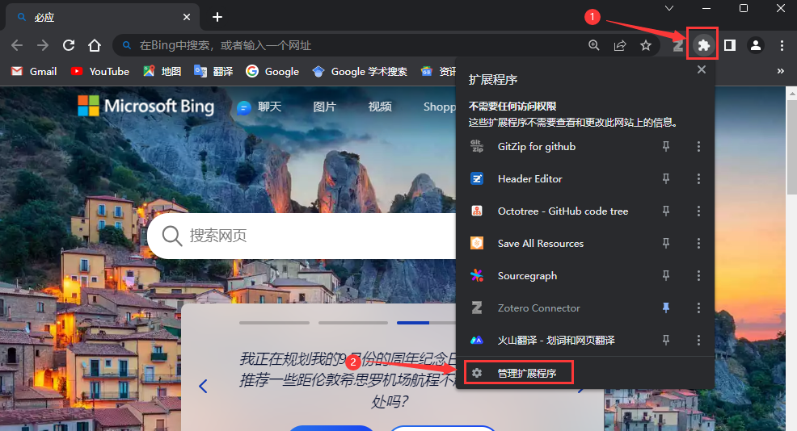
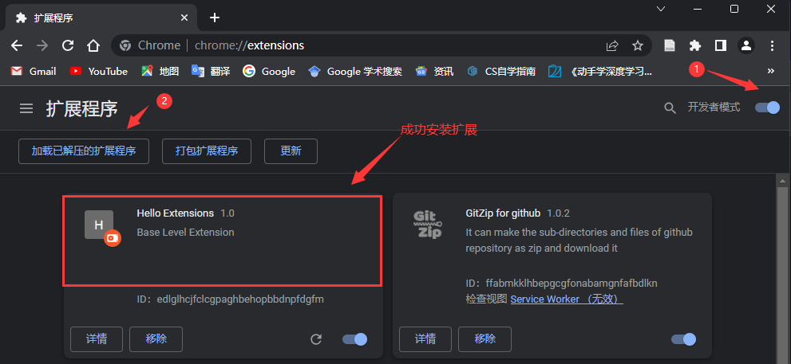
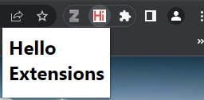
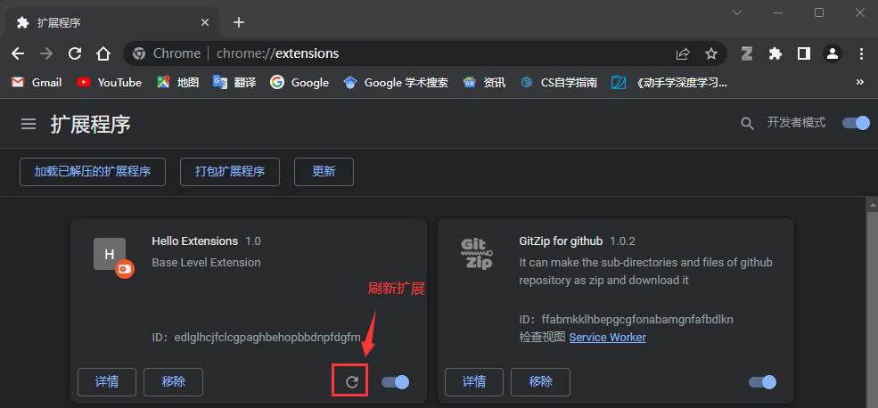
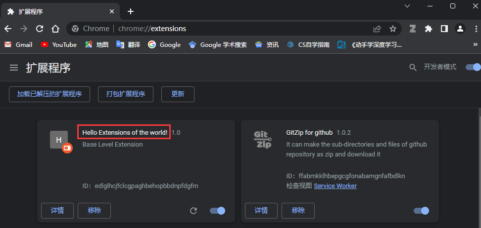
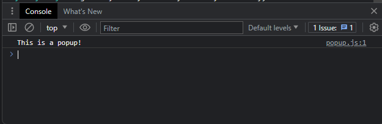
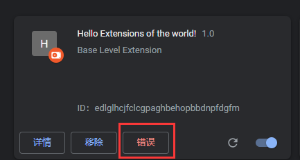
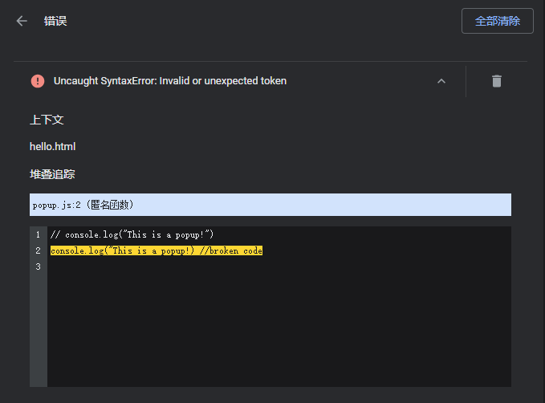

> 本扩展开发文档翻译于Google官方文档[Chrome Extension development basics - Chrome Developers](https://developer.chrome.com/docs/extensions/mv3/getstarted/development-basics/)


# 一、扩展开发

**hello-world**扩展开发的具体流程如下：

1. 创建目录`hello-world`， 存放源代码

2. 在此目录中创建一个名为`manifest.json`的新文件并添加以下代码：
   > 注意：必须将`manifest.json`文件放在扩展的**根目录**中。
   ```
   {
     "manifest_version": 3,
     "name": "Hello Extensions",
     "description": "Base Level Extension",
     "version": "1.0",
     "action": {
       "default_popup": "hello.html",
       "default_icon": "hello_extensions.png"
     }
   }
   ```

   这个JSON对象描述了扩展的功能和配置。例如，“action”键声明了Chrome应该用作扩展的操作图标的图像，以及单击扩展的操作图标时在弹出窗口中显示的超文本标记语言页面。将[图标](https://storage.googleapis.com/web-dev-uploads/image/WlD8wC6g8khYWPJUsQceQkhXSlv1/gmKIT88Ha1z8VBMJFOOH.png)下载到您的目录，并确保更改其名称以匹配“`default_icon`”键中的内容。

3. 对于弹出窗口，创建一个名为`hello. html`的文件，并添加以下代码：

   ```
   <html>
     <body>
       <h1>Hello Extensions</h1>
     </body>
   </html>
   ```

   现在，当单击扩展的操作图标（工具栏图标）时，扩展会显示一个弹出窗口。让我们通过在本地加载它来Chrome测试它。确保所有文件都已保存。

> [扩展开发源码链接](https://github.com/idealzouhu/chrome-extension-example/tree/main/hello-world)


# 二、加载未打包的扩展

在开发人员模式下加载解压的扩展：

1.  通过在新选项卡中输入`chrome：//`扩展进入扩展页面。(也可以通过单击扩展菜单拼图按钮，然后选择菜单底部的管理扩展等方式进入扩展页面)

2. 通过单击开发人员模式旁边的切换开关启用开发人员模式，然后单击按钮`加载已解压的扩展程序`并选择扩展目录。

> 扩展程序已成功安装。由于`manifest.json`中没有包含扩展程序图标，因此将为扩展程序创建一个通用图标。


# 三、扩展使用结果

单击扩展程序的操作图标（工具栏图标）, 会看到一个弹出窗口 。 弹出窗口的内容为`hello. html`文件里面的内容。

> 默认情况下，当您在本地加载扩展时，它会出现在扩展菜单中。将您的扩展**固定**到工具栏可以在开发过程中快速访问您的扩展。




# 四、重新加载扩展程序

修改`manifest.json`的代码并将扩展的名称更改为“Hello Extension of the world！”

```json
{
  "manifest_version": 3,
  "name": "Hello Extensions of the world!",
  ...
}
```

保存文件后，要在浏览器中查看此更改，您还<font color="red">**必须刷新扩展**</font>。转到扩展页面并单击开/关切换旁边的刷新图标：



刷新扩展后，重新加载扩展程序的结果如下：



<br><br>

并非所有组件都需要重新加载才能查看所做的更改，如下表所示：

| Extension component        | Requires extension reload |
| -------------------------- | ------------------------- |
| The manifest               | Yes                       |
| Service worker             | Yes                       |
| Content Scripts            | Yes (plus the host page)  |
| The popup                  | No                        |
| Options page               | No                        |
| Other extension HTML pages | No                        |


# 五、查找控制台日志和错误日志

## 5.1 Console logs

在开发过程中，您可以通过访问浏览器控制台日志来调试代码。在这种情况下，我们将找到弹出窗口的日志。首先向`hello. html`添加脚本标记。

```
<html>
  <body>
    <h1>Hello Extensions</h1>
    <script src="popup.js"></script>
  </body>
</html>
```

然后，创建一个`popup.js`文件并添加以下代码

```js
console.log("This is a popup!")
```

> 注意，由于此时添加了Content Scripts这部分内容， 需要重新加载扩展程序

<br>

要查看控制台中记录的此消息，具体步骤为：

1. 打开弹出窗口。
2. 右键单击弹出窗口。
3. 选择**检查**。
4. 在**DevTool**s中，浏览器会自动导航到控制台面板。




## 5.2 Error logs

在`popup.js`文件中添加一段错误的代码：

```
console.log("This is a popup!) //broken code
```

转到扩展页面并打开弹出窗口， 将出现一个错误按钮。



单击`错误`按钮可以了解有关错误的更多信息：



> 要了解有关service worker, options page, and content scripts 的更多信息，可以查阅[Debugging extensions](https://developer.chrome.com/docs/extensions/mv3/tut_debugging/).。