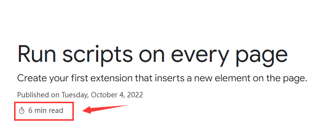

> 本插件开发文档翻译于Google官方文档[Chrome Extensions Tutorial: Reading time - Chrome Developers](https://developer.chrome.com/docs/extensions/mv3/getstarted/tut-reading-time/)

# 一、reading-time

**reading-time**项目的功能是  将预期的阅读时间添加到任何Chrome extension 和 Chrome Web Store documentation 页面里面

通过这个项目，我们可以更加具体地学到以下内容：

- The extension manifest.
- What icon sizes an extension uses.
- **How to inject code into pages using [content scripts](https://developer.chrome.com/docs/extensions/mv3/content_scripts/).**
- How to use match patterns.
- Extension permissions.


# 二、Build the extension

## 2.1 添加扩展的基本信息

在项目的根目录中创建一个`manifest.json`文件并添加以下代码：

```
{
  "manifest_version": 3,
  "name": "Reading time",
  "version": "1.0",
  "description": "Add the reading time to Chrome Extension documentation articles"
}
```

这些键包含扩展的基本元数据。它们控制扩展在扩展页面上的显示方式，以及发布后在Chrome网上商店中的显示方式。

> 要深入了解，请查看 [Manifest overview page](https://developer.chrome.com/docs/extensions/mv3/manifest/) .


## 2.2 提供图标icons

为什么我们需要图标icons？虽然 [icons](https://developer.chrome.com/docs/extensions/mv3/manifest/icons/) 在开发过程中是可选的，但如果您计划在Chrome网上商店分发扩展，它们是必需的。它们也出现在扩展页面等其他地方。

创建一个`image`文件夹并将图标放在里面，您可以在GitHub上下载图标。接下来，将突出显示的代码添加到您的 `manifest.json` 中以声明图标：

```
{
  ...
  "icons": {
    "16": "images/icon-16.png",
    "32": "images/icon-32.png",
    "48": "images/icon-48.png",
    "128": "images/icon-128.png"
  }
  ...
}
```

> 建议使用PNG文件，但允许使用其他文件格式，SVG文件除外。

这些不同大小的**Icons**显示在哪里？

| Icon size | Icon use                                                |
| --------- | ------------------------------------------------------- |
| 16x16     | Favicon on the extension's pages and context menu icon. |
| 32x32     | Windows computers often require this size.              |
| 48x48     | Displays on the Extensions page.                        |
| 128x128   | Displays on installation and in the Chrome Web Store.   |


## 2.3 声明content script

扩展可以运行读取和修改页面内容的脚本, 这些称为**内容脚本(content script)**。它们生活在一个 [isolated world](https://developer.chrome.com/docs/extensions/mv3/content_scripts/#isolated_world)中，这意味着它们可以更改JavaScript环境，而不会与主机页面或其他扩展的内容脚本发生冲突。

将以下代码添加到`manifest.json`以注册名为content.js的内容脚本。

```
{
  ...
  "content_scripts": [
    {
      "js": ["scripts/content.js"],
      "matches": [
        "https://developer.chrome.com/docs/extensions/*",
        "https://developer.chrome.com/docs/webstore/*"
      ]
    }
  ]
}
```

`“matches”`字段可以有一个或多个 [匹配模式](https://developer.chrome.com/docs/extensions/mv3/match_patterns/)。这些<font color="red">**允许浏览器识别要将内容脚本注入哪些站点**</font>。

匹配模式由三部分组成`<scheme>://<host><path>`。它们可以包含'`*`'字符。

> 当用户安装扩展时，浏览器会通知他们扩展可以做什么。内容脚本请求在满足匹配模式条件的站点上运行的权限。


## 2.4 计算并插入阅读时间

内容脚本可以使用 [Document Object Model](https://developer.mozilla.org/docs/Web/API/Document_Object_Model)（DOM）来读取和更改页面的内容。扩展程序将首先检查页面是否包含`<article>`元素。然后，它将计算该元素中的所有单词，并创建一个显示总阅读时间的段落。

在名为`scripts`的文件夹中创建一个名为`content. js`的文件并添加以下代码：

```javascript
const article = document.querySelector("article");

// `document.querySelector` may return null if the selector doesn't match anything.
if (article) {
  const text = article.textContent;
  const wordMatchRegExp = /[^\s]+/g; // Regular expression
  const words = text.matchAll(wordMatchRegExp);
  // matchAll returns an iterator, convert to array to get word count
  const wordCount = [...words].length;
  const readingTime = Math.round(wordCount / 200);
  const badge = document.createElement("p");
  // Use the same styling as the publish information in an article's header
  badge.classList.add("color-secondary-text", "type--caption");
  badge.textContent = `⏱️ ${readingTime} min read`;

  // Support for API reference docs
  const heading = article.querySelector("h1");
  // Support for article docs with date
  const date = article.querySelector("time")?.parentNode;

  (date ?? heading).insertAdjacentElement("afterend", badge);
}
```


# 三、Test that it works

这里有些页面你可以打开看看每篇文章需要多长时间才能阅读。

- [Welcome to the Chrome Extension documentation](https://developer.chrome.com/docs/extensions/mv3/)
- [Publish in the Chrome Web Store](https://developer.chrome.com/docs/webstore/publish/)

- [Understanding Content Scripts](https://developer.chrome.com/docs/extensions/mv3/content_scripts/)

选择页面https://developer.chrome.com/docs/extensions/mv3/getstarted/tut-reading-time/，查看插件显示的阅读时间：

